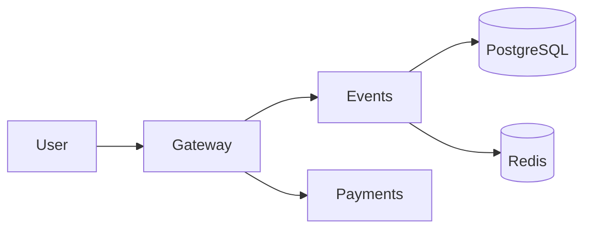

# Lab 1 — Deploy, Break, Understand

## Environment

Docker version 29.2.1, Docker Compose v5.0.2. The application Dockerfiles use `python:3.13-slim`.

## Deployment

```text
NAME             IMAGE          STATUS
app-events-1     app-events     Up
app-gateway-1    app-gateway    Up
app-payments-1   app-payments   Up
app-postgres-1   postgres:17-alpine Up (healthy)
app-redis-1      redis:7-alpine Up (healthy)
```

## Critical Path

```text
GET /events -> HTTP_STATUS:200
POST /events/1/reserve -> HTTP_STATUS:200
{"reservation_id":"539e690f-3a1f-46b4-b270-02405521947e","event_id":1,"quantity":1,"total_cents":5000,"expires_in_seconds":300}
POST /reserve/539e690f-3a1f-46b4-b270-02405521947e/pay -> HTTP_STATUS:200
{"order_id":"539e690f-3a1f-46b4-b270-02405521947e","event_id":1,"quantity":1,"total_cents":5000,"status":"confirmed"}
GET /health -> HTTP_STATUS:200
{"status":"healthy","checks":{"events":"ok","payments":"ok","circuit_payments":"CLOSED"}}
```

## Dependency Map



PostgreSQL stores events and confirmed orders. Redis stores temporary reservations; gateway charges through payments and then asks events to confirm the order.

## Failure Exploration

| Component stopped | Events list | Reserve | Pay | Health check | User impact |
|---|---|---|---|---|---|
| payments | 200 | 200 | 502 `Payment service unavailable` | 503, payments down | Browsing and holds continued; payment did not. |
| events | 502 | 502 | 500 `Payment succeeded but confirmation failed — contact support` | 503, events down | A charge was accepted but the order was not confirmed. |
| redis | 200 | 504 `Events service timeout` | 500 confirmation failed | 503, events down | Existing Events process could list data but reservation/confirmation depended on Redis. |
| postgres | 502 | 500 `Internal Server Error` | 500 confirmation failed | 503, events degraded | Event database operations failed. |

The Redis health result was checked after six seconds. After Redis and PostgreSQL recovery, I restarted Events and `/health` returned 200.

## Graceful Degradation

The gateway now catches `httpx.ConnectError` before the generic exception in the payment handler.

```text
POST /reserve/d0f68fb3-90d8-46b3-b629-dd89aa57a40f/pay (payments stopped)
HTTP/1.1 503 Service Unavailable
{"error":"payments_unavailable","message":"Payment service is temporarily down. Your reservation is held — try again in a few minutes.","reservation_id":"d0f68fb3-90d8-46b3-b629-dd89aa57a40f"}

Retry after recovery: HTTP/1.1 200 OK
{"order_id":"d0f68fb3-90d8-46b3-b629-dd89aa57a40f","event_id":1,"quantity":1,"total_cents":5000,"status":"confirmed"}
```

## Load Test

The supplied Bash generator could not run because this Windows environment has no installed WSL distribution or `/bin/bash`. An equivalent PowerShell generator was started using the same 70/20/10 request mix; no completed output was available, so I do not report invented request counts or an error spike.

## Resource Usage Bonus

Idle sample from `docker stats --no-stream`:

```text
app-gateway-1  0.18%  38.03MiB  6.77kB / 5.39kB
app-events-1   0.17%  40.77MiB  6.62kB / 5.86kB
app-payments-1 0.17%  33.38MiB  1.65kB / 746B
app-postgres-1 0.02%  23.74MiB  7.82kB / 5.89kB
app-redis-1    0.42%  3.461MiB 10.7kB / 3.74kB
```

No load/chaos comparison is claimed because the required load run did not complete in this environment.

## GitHub Community

Stars help users discover and bookmark projects, and signal community interest. Following developers helps track relevant work and build collaboration networks. GitHub CLI was not installed, and classmate usernames were not provided, so I did not claim any stars or follows.

## Conclusions

QuickTicket has a direct payment dependency for checkout and stateful dependencies behind Events. The 503 response preserves a valid reservation and gives the user an actionable recovery path.
