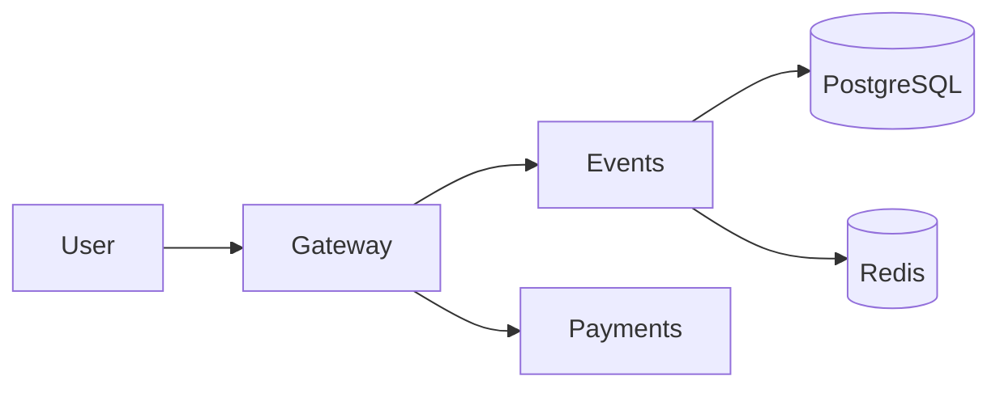

# Lab 1 — Deploy, Break, Understand

## Environment

Docker version 29.2.1, Docker Compose v5.0.2. The application Dockerfiles use `python:3.13-slim`.

## Deployment

```text
NAME             IMAGE                COMMAND                  SERVICE    STATUS
app-events-1     app-events           "uvicorn main:app --…"   events     Up
app-gateway-1    app-gateway          "uvicorn main:app --…"   gateway    Up
app-payments-1   app-payments         "uvicorn main:app --…"   payments   Up
app-postgres-1   postgres:17-alpine   "docker-entrypoint.s…"   postgres   Up (healthy)
app-redis-1      redis:7-alpine       "docker-entrypoint.s…"   redis      Up (healthy)
```

## Critical Path

```text
GET /events -> HTTP_STATUS:200
POST /events/1/reserve -> HTTP_STATUS:200
{"reservation_id":"539e690f-3a1f-46b4-b270-02405521947e","event_id":1,"quantity":1,"total_cents":5000,"expires_in_seconds":300}
POST /reserve/539e690f-3a1f-46b4-b270-02405521947e/pay -> HTTP_STATUS:200
{"order_id":"539e690f-3a1f-46b4-b270-02405521947e","event_id":1,"quantity":1,"total_cents":5000,"status":"confirmed"}
GET /health -> HTTP_STATUS:200
{"status":"healthy","checks":{"events":"ok","payments":"ok","circuit_payments":"CLOSED"}}
```

## Dependency Map



PostgreSQL stores events and confirmed orders. Redis stores temporary reservations; gateway charges through payments and then asks events to confirm the order.

## Failure Exploration

| Component stopped | Events list | Reserve | Pay | Health check | User impact |
|---|---|---|---|---|---|
| payments | 200 | 200 | 502 `Payment service unavailable` | 503, payments down | Browsing and holds continued; payment did not. |
| events | 502 | 502 | 500 `Payment succeeded but confirmation failed — contact support` | 503, events down | A charge was accepted but the order was not confirmed. |
| redis | 200 | 504 `Events service timeout` | 500 confirmation failed | 503, events down | Existing Events process could list data but reservation/confirmation depended on Redis. |
| postgres | 502 | 500 `Internal Server Error` | 500 confirmation failed | 503, events degraded | Event database operations failed. |

The Redis health result was checked after six seconds. After Redis and PostgreSQL recovery, I restarted Events and `/health` returned 200.

## Graceful Degradation

The gateway now catches `httpx.ConnectError` before the generic exception in the payment handler.

```diff
diff --git a/app/gateway/main.py b/app/gateway/main.py
@@
+    except httpx.ConnectError:
+        log.error("payments connection unavailable")
+        return JSONResponse(
+            status_code=503,
+            content={
+                "error": "payments_unavailable",
+                "message": "Payment service is temporarily down. Your reservation is held — try again in a few minutes.",
+                "reservation_id": reservation_id,
+            },
+        )
```

```text
POST /events/1/reserve (payments stopped) -> HTTP/1.1 200 OK
{"reservation_id":"93062ab3-8333-45ed-8216-0a3cbe4683b4","event_id":1,"quantity":1,"total_cents":5000,"expires_in_seconds":300}
POST /reserve/93062ab3-8333-45ed-8216-0a3cbe4683b4/pay (payments stopped)
HTTP/1.1 503 Service Unavailable
{"error":"payments_unavailable","message":"Payment service is temporarily down. Your reservation is held — try again in a few minutes.","reservation_id":"93062ab3-8333-45ed-8216-0a3cbe4683b4"}

Retry after recovery: HTTP/1.1 200 OK
{"order_id":"93062ab3-8333-45ed-8216-0a3cbe4683b4","event_id":1,"quantity":1,"total_cents":5000,"status":"confirmed"}
```

## Load Test

The original generator ran inside an ephemeral Alpine container with `bash`, `curl`, and `bc`, a read-only mount of `app/loadgen`, and `GATEWAY_URL=http://host.docker.internal:3080`. The script sends approximately 70% reads, 20% reservations, and 10% purchase flows, so a payments outage mainly affects purchases.

```text
Baseline, 5 RPS / 30 seconds
[10s] requests=43 success=43 fail=0 error_rate=0%
[20s] requests=92 success=92 fail=0 error_rate=0%

Payments stopped from about 10s to 22s, 5 RPS / 30 seconds
[10s] requests=43 success=40 fail=3 error_rate=6.9%
[20s] requests=92 success=83 fail=9 error_rate=9.7%
Done. total=132 success=118 fail=14 error_rate=10.6%
```

## Resource Usage Bonus

| Scenario | Service | CPU | Memory | Network I/O | PIDs |
|---|---|---:|---:|---:|---:|
| Idle | gateway | 0.16% | 38.6MiB | 581kB / 555kB | 3 |
| Idle | events | 0.15% | 41.27MiB | 486kB / 658kB | 2 |
| Idle | payments | 0.15% | 33.4MiB | 2.76kB / 1.49kB | 2 |
| Idle | postgres | 0.00% | 24.35MiB | 485kB / 566kB | 8 |
| Idle | redis | 0.40% | 3.496MiB | 129kB / 55kB | 6 |
| Load | gateway | 3.72% | 38.39MiB | 90.3kB / 86.5kB | 3 |
| Load | events | 2.53% | 41.07MiB | 87.4kB / 115kB | 2 |
| Load | payments | 0.15% | 33.4MiB | 2.47kB / 1.37kB | 2 |
| Load | postgres | 0.75% | 24.21MiB | 260kB / 299kB | 8 |
| Load | redis | 0.48% | 3.484MiB | 79.2kB / 33.5kB | 6 |
| Chaos | gateway | 2.49% | 38.86MiB | 658kB / 632kB | 3 |
| Chaos | events | 1.27% | 41.28MiB | 559kB / 753kB | 2 |
| Chaos | payments | 0.40% | 34.8MiB | 2.91kB / 1.82kB | 2 |
| Chaos | postgres | 0.36% | 24.35MiB | 523kB / 615kB | 8 |
| Chaos | redis | 3.27% | 3.492MiB | 133kB / 56.8kB | 6 |

Events used the most memory in every captured sample. Gateway used the most CPU in the normal load sample; under injected latency it retained more connections while waiting for payments, so its memory and network counters grew. Chaos load finished with 24 failures from 214 requests (11.2%), reflecting injected failures plus slower purchase flows.

```text
payments /health after restoration:
{"status":"healthy","failure_rate":0.0,"latency_ms":0}
gateway /health: HTTP/1.1 200 OK
```

## GitHub Community

I starred `inno-devops-labs/SRE-Intro` and `simple-container-com/api`, and followed Cre-eD, Naghme98, pierrepicaud, MariKarrp, AnnaTikhonova-prog, and dariapotapova. Stars help save and promote useful open-source projects; following helps track developers' work and maintain professional connections.

## Conclusions

QuickTicket has a direct payment dependency for checkout and stateful dependencies behind Events. The 503 response preserves a valid reservation and gives the user an actionable recovery path.
